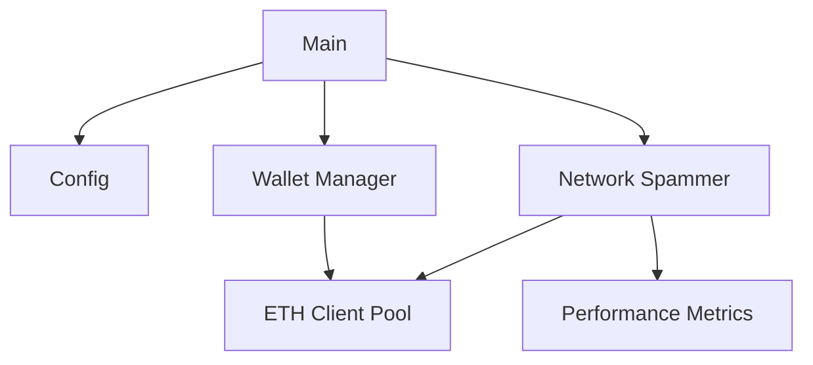

# Spam EVM

A high-performance load testing tool for Ethereum Virtual Machine (EVM) networks. This tool allows you to stress test EVM-compatible networks by sending concurrent transactions from multiple wallets.

## Features

- Multi-wallet support with configurable private keys
- Connection pooling for optimal network performance
- Configurable CPU utilization and concurrency
- Detailed performance metrics and analysis
- Support for multiple EVM-compatible networks
- Auto-scaling based on available CPU cores

## Installation

1. Ensure you have Go 1.19 or later installed
2. Clone the repository:
```bash
git clone https://github.com/yourusername/spam-evm.git
cd spam-evm
```
3. Install dependencies:
```bash
go mod download
```

## Configuration

1. Create a `private-keys.txt` file with one private key per line
2. Customize network settings in `config/config.go`:
   - RPC endpoints
   - CPU multiplier
   - Max concurrency
   - Connection pool size

## Usage

1. Build the project:
```bash
go build
```

2. Run the spammer:
```bash
./spam-evm
```

The tool will automatically:
- Load private keys and create corresponding wallets
- Establish connection pools to the network
- Start sending transactions concurrently
- Display real-time performance metrics

## Performance Monitoring

The tool provides detailed metrics including:
- Connection establishment time
- Transactions per second (TPS)
- Success/failure rates
- Network latency
- Resource utilization

## Architecture



## Best Practices

1. Start with a small number of wallets and gradually increase
2. Monitor system resources during testing
3. Adjust CPU multiplier and concurrency based on network capacity
4. Use multiple RPC endpoints for better load distribution
5. Ensure sufficient funds in test wallets

## Troubleshooting

Common issues and solutions:
- **Connection errors**: Check RPC endpoint availability and rate limits
- **Out of gas**: Ensure wallets have sufficient funds
- **Poor performance**: Try adjusting CPU multiplier and connection pool size

## Contributing

Contributions are welcome! Please feel free to submit a Pull Request.
